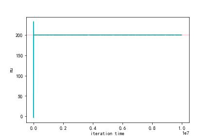
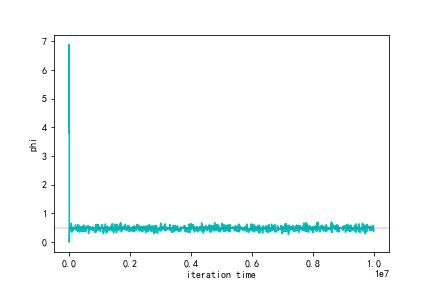
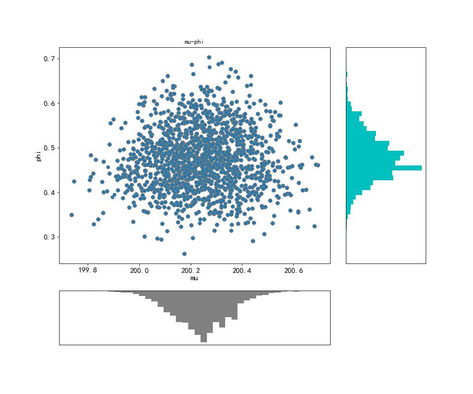

### Problem 1 
1. 马尔可夫链存在平稳序列的条件及其收敛分布:

马尔可夫链存在平稳序列，即指的是，在一定的迭代次数后，每次得到的数值所对应的分布将收敛成同一个分布，具体表现为下面所说的马尔可夫平稳条件：即t+1时$\pi_{t+1}$取$\theta^*$的概率为其他不同状态的$\theta$转移成$\theta^*$的概率之和。
在积分形式下，即马尔可夫链存在平稳序列的条件为: $\pi_{t+1}(\theta^*)=\int \pi_t(\theta)p(\theta \rightarrow \theta^*)d\theta$, $p(\theta \rightarrow \theta^*)$表示在$\theta$状态转移到$\theta^*$的概率。

如果存在一个分布$\pi(\theta)$在满足平稳序列条件时：$\pi(\theta^*)=\int \pi(\theta)p(\theta \rightarrow \theta^*)d\theta$, 且 $\sum_{i=1}^N{\pi(\theta_i)}=1$，这里假设$\theta$共有N个状态。则该马尔可夫链最终收敛到一个平稳分布：该收敛分布为$\pi(\theta)$。

2. 证明细致平稳条件是马尔可夫平稳条件的充分条件：

马尔可夫链的detailed balance条件为: $\pi(\theta^*)p(\theta^* \rightarrow \theta)=\pi(\theta)p(\theta \rightarrow \theta^*)$

下证细致平稳条件是马尔可夫平稳条件的充分条件：
$$
\begin{aligned}
\int \pi(\theta)p(\theta \rightarrow \theta^*)d\theta 
              &= \int \pi(\theta^*)p(\theta^* \rightarrow \theta)d\theta 
              &= \pi(\theta^*) \int p(\theta^* \rightarrow \theta)d\theta 
              &= \pi(\theta^*)
\end{aligned}
$$

所以细致平稳条件是马尔科夫链平稳条件的充分条件，当满足细致平稳条件时,马尔可夫链存在平稳序列,将收敛到$\pi(\theta)$分布。

3. 证明该MH采样算法是符合马尔科夫链的细致平稳条件的：

由题目可知，该转移概率$p(\theta \rightarrow \theta^*)=g(\theta^*|\theta)\alpha_{\theta \rightarrow \theta^*}$，proposal function: $g(\theta^*|\theta)$，$\alpha_{\theta \rightarrow \theta^*}=min(1,\frac{\pi(\theta^*)g(\theta|\theta^*)}{\pi(\theta)g(\theta^*|\theta)})$。

$$
\begin{aligned}
\pi(\theta)p(\theta \rightarrow \theta^*)
              &= \pi(\theta)g(\theta^*|\theta)\alpha_{\theta \rightarrow \theta^*} \\
              &= \pi(\theta)g(\theta^*|\theta)min(1,\frac{\pi(\theta^*)g(\theta|\theta^*)}{\pi(\theta)g(\theta^*|\theta)}) \\
              &=min(\pi(\theta)g(\theta^*|\theta),\pi(\theta^*)g(\theta|\theta^*)) \\
              &= \pi(\theta^*)g(\theta|\theta^*)min(\frac{\pi(\theta)g(\theta^*|\theta)}{\pi(\theta^*)g(\theta|\theta^*)},1) \\
              &= \pi(\theta^*)g(\theta|\theta^*)\alpha_{\theta^* \rightarrow \theta} \\
              &= \pi(\theta^*) p(\theta^* \rightarrow \theta) \\
\end{aligned}
$$

4. 综上：该算法满足细致平稳条件，所以该算法的马尔可夫链存在平稳序列，且该平稳分布即为$\pi(·)$，即当马尔可夫迭代到一定次数后，算法的采样是从目标分布$\pi(·)$中抽取，同时该$\pi(·)$也即是由MH算法定义的马尔可夫平稳分布。

### Problem 2
#### Part 1

##### pseudo code:
<pre class="pseudocode" lineNumber="true">
\begin{algorithm}
\caption{Metropolis-Hastings Sampler}
\begin{algorithmic}
\STATE set $\mu_0=0,\phi=5$
\STATE sampler,$(\mu^*,\phi^*)$~$g(\mu^*,\phi^*|\mu,\phi), g(\mu^*,\phi^*|\mu,\phi)=\frac{1}{3\mu+2}\frac{1}{\phi}$ is 2D uniform distribution(proposal function),$\mu$~$UNIF(-\frac{3\mu}{2}-1,\frac{3\mu}{2}+1)$,$\phi$~$UNIF(\frac{\phi}{2},\frac{3\phi}{2})$
\STATE $\alpha=$min$(1, \frac{p(\mu^*,\phi^*|X)g(\mu,\phi|\mu^*,\phi^*)}{p(\mu,\phi|X)g(\mu^*,\phi^*|\mu,\phi)})$ 
\STATE with probability $\alpha$, set $(\mu,\phi)=(\mu^*,\phi^*)$ 
\STATE store $(\mu,\phi)$, and repeat starting at step 2 
\end{algorithmic}
\end{algorithm}
</pre>


#### Part 2



通过代码遍历结果，得知道$\mu$的burn-in time是2075次迭代左右，$\phi$的burn-in time是94000次迭代左右。
并展示两个变量的after burn-in的marginal posteriors直方图，这里取94000次迭代后的数据进行marginal histogram图的绘制。



```python
# 算法部分
# 生成随机的X
import numpy as np
from scipy import stats
import matplotlib.pyplot as plt
np.random.seed(20221223)
mu0=200
sigma0=np.sqrt(2)
X=stats.norm.rvs(mu0,sigma0,size=100)

def proposal_sampler(mu,phi):
    mu_update = np.random.uniform(-3*mu/2-1,3*mu/2+1)
    phi_update = np.random.uniform(phi/2,3*phi/2)
    return mu_update, phi_update

def probcompute(mu1,phi1,mu2,phi2, X):
    g_up = 1/(3*mu2+2)*1/(phi2)
    g_down = 1/(mu1+2)*1/(phi1)
    p_up = np.power(phi2,100/2-1)*np.exp(-(phi2/2)*sum([x*x for x in list(X-mu2)]))
    p_down = np.power(phi1,100/2-1)*np.exp(-(phi1/2)*sum([x*x for x in list(X-mu1)]))
#     print(g_up*p_up/(g_down*p_down))
    return g_up*p_up/(g_down*p_down)

def mcmc(mu, phi,X):
#    sampler
    mu_update, phi_update = proposal_sampler(mu,phi)
    alpha = np.random.random(1)
    if alpha < min(1,probcompute(mu,phi,mu_update,phi_update,X)):
        mu = mu_update
        phi = phi_update
    return mu, phi

if __name__ == '__main__':
    # initialize
    mu = 0
    phi =5
    u_list = []
    phi_list = []
    for i in range(10000000):
        mu,phi = mcmc(mu,phi,X)
        u_list.append(mu)
        phi_list.append(phi)
    plt.plot(u_list, c='c')
    plt.ylabel('mu')
    plt.xlabel('iteration time')
    plt.axhline(200,c='r',linewidth=0.3)
    plt.savefig('D:/lecture/final_for_prob/mu_trace.jpg')
    plt.show()
    plt.plot(phi_list, c='c')
    plt.ylabel('phi')
    plt.xlabel('iteration time')
    plt.axhline(0.5,c='r',linewidth=0.3)
    plt.savefig('D:/lecture/final_for_prob/phi_trace.jpg')
    plt.show()

# 直方图绘制
import matplotlib.pyplot as plt
import matplotlib.ticker as mticker
import pandas as pd

# 获取数据
u_his = u_list[94000:]
phi_his = phi_list[94000:]
df = pd.DataFrame({'mu':u_his,'phi':phi_his},columns=['mu','phi'])
# df.count = 

# 创建画布并将画布分割成格子
fig = plt.figure(figsize=(12, 10), dpi=80, facecolor='white')
grid = plt.GridSpec(4, 4, hspace=0.5, wspace=0.2)

# 添加子图
ax_main = fig.add_subplot(grid[:-1, :-1])
ax_right = fig.add_subplot(grid[:-1, -1], xticklabels=[], yticklabels=[])
ax_bottom = fig.add_subplot(grid[-1, :-1], xticklabels=[], yticklabels=[])

# 在中心绘制气泡图
ax_main.scatter('mu', 'phi'
#                 , s=df.count * 4 # 点的大小为数量的多少
                , data=df #数据集
                , cmap='tab10' # 调色板
                , edgecolors='gray' # 边缘颜色
                , linewidth=.5 # 线宽
                , alpha=.9) # 透明度
# 绘制底部直方图
ax_bottom.hist(df.mu, 40, histtype='stepfilled', orientation='vertical', color='grey')
ax_bottom.invert_yaxis()  # 让y轴反向

# 绘制右边直方图
ax_right.hist(df.phi, 40, histtype='stepfilled', orientation='horizontal', color='c')

# 装饰图像
plt.rcParams['font.sans-serif'] = ['Simhei']
ax_main.set(title='mu-phi'
            , xlabel='mu'
            , ylabel='phi')
ax_main.title.set_fontsize = (20)

for item in ([ax_main.xaxis.label, ax_main.yaxis.label] + ax_main.get_xticklabels() + ax_main.get_yticklabels()):
    item.set_fontsize(14)

for item in [ax_bottom, ax_right]:
    item.set_xticks([]) # 去掉直方图的标尺
    item.set_yticks([])

label_format = '{:,.1f}'  # 创建浮点数格式 .1f一位小数
xlabels = ax_main.get_xticks().tolist()
ax_main.xaxis.set_major_locator(mticker.FixedLocator(xlabels))  # 定位到散点图的x轴
ax_main.set_xticklabels([label_format.format(x) for x in xlabels])  # 使用列表推导式循环将刻度转换成浮点数
plt.savefig('D:/lecture/final_for_prob/marginal_hist.jpg')
plt.show()

# compute burn-in time
for i in range(len(u_list)):
    if u_list[i]>198 and u_list[i]<202:
        print(i)
        break
for i in range(len(phi_list)):
    if phi_list[i]>0.49 and phi_list[i]<0.51:
        print(i)
        break
```